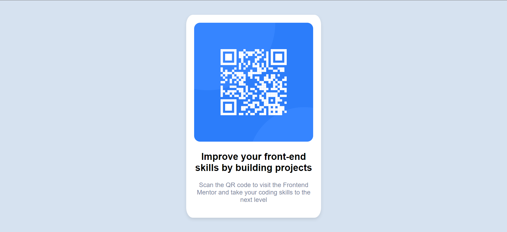

# Frontend Mentor - QR code component solution

This is a solution to the [QR code component challenge on Frontend Mentor](https://www.frontendmentor.io/challenges/qr-code-component-iux_sIO_H). Frontend Mentor challenges help you improve your coding skills by building realistic projects. 

## Table of contents

- [Overview](#overview)
  - [Screenshot](#screenshot)
  - [Links](#links)
- [My process](#my-process)
  - [Built with](#built-with)
  - [What I learned](#what-i-learned)
- [Author](#author)

## Overview

This was my first solution for Frontend Mentor. A small html and css test.

### Screenshot

### Links

- Solution URL: [Solution](https://www.frontendmentor.io/solutions/qrcodecard-6S4o_Gz65m)
- Live Site URL: [Live Site](https://ahmadikhdair.github.io/QR-code-card/)

## My process

### Built with

- Semantic HTML5 markup
- CSS
- Flexbox

### What I learned

Practiced basic HTML & CSS.

## Author

- LinkedIn - [Ahmad Ikhdair](https://www.linkedin.com/in/ahmad-ikhdair/)
- Frontend Mentor - [Ahmad Ikhdair](https://www.frontendmentor.io/profile/AhmadIkhdair)

